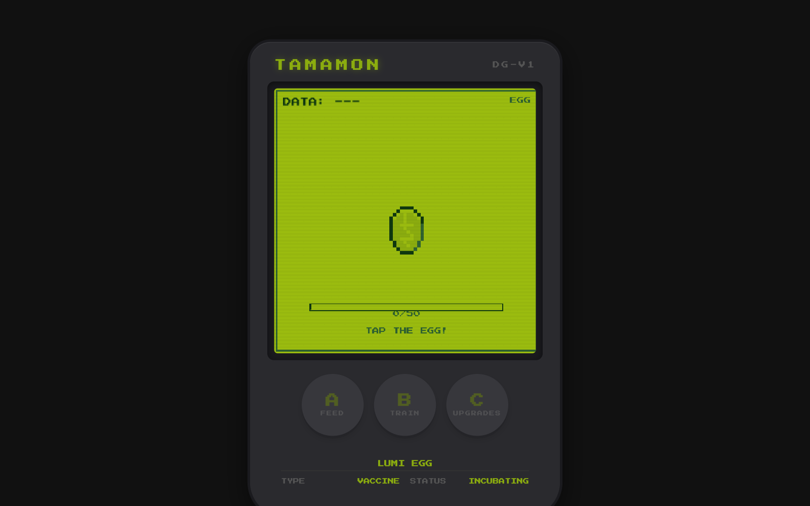
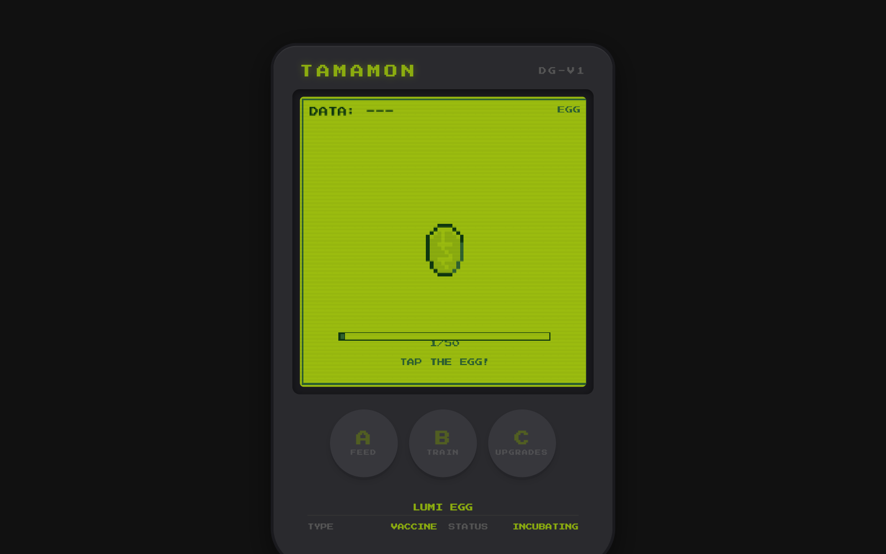

<div align="center">



# 🥚 Tamamon

*Cría, alimenta y evoluciona tu propio monstruo digital al estilo Digivice* 🐲

[](https://gavilanbe.github.io/tamamon/)


</div>

---

## 🕹️ Qué es esto

**Tamamon** es un juego **idle/clicker** de monstruo digital con estética **Game Boy + Digivice**. Empiezas con un huevo: tócalo sin parar hasta hacerlo eclosionar y, a partir de ahí, alimenta y entrena a tu criatura, acumula DATA, compra mejoras y guíala a través de **6 etapas de evolución**: 🥚 HUEVO → 👶 BEBÉ → 🧒 NIÑO → 🧑 ADULTO → ✨ PERFECTO → 👑 MEGA.

El juego corre dentro de un marco de dispositivo retro con pantalla LCD verde pixelada, partículas, efectos de eclosión/evolución y notificaciones tipo toast. Todo el progreso se guarda en `localStorage` (con autoguardado y cálculo de ganancias offline), así que tu Tamamon sigue creciendo aunque cierres la pestaña.

## 📖 La historia

En el mundo de **Tamamon**, las criaturas no son carne y hueso: son **datos vivos** que nacen dentro de huevos digitales. Existen tres huevos iniciales, cada uno de un tipo distinto:

- 🐲 **PYRO EGG** — linaje *Dragón*.
- 💾 **BYTE EGG** — linaje *Data*.
- ✨ **LUMI EGG** — linaje *Vacuna*.

A medida que cuidas a tu criatura, esta evoluciona por **ramas que dependen de cómo la críes**: si priorizas el ataque o la defensa, si la alimentas mucho... el camino cambia. Así emergen tipos como **Dragón, Data, Virus, Máquina, Sacro y Vacuna**, desde formas bebé hasta megaevoluciones definitivas como PYREXMON, OMEGAVIRUS o DIVINEMON. Cada partida puede contar una historia distinta. 🌱

## 🎮 Cómo se juega

| Acción | Control | Qué hace |
| --- | --- | --- |
| 👆 Tocar / clicar | Pantalla del dispositivo | Hace eclosionar el huevo y genera **DATA** por toque |
| 🍖 **A** | Botón A — FEED | Alimenta a tu Tamamon: sube **HP** y puntos de crecimiento |
| 🏋️ **B** | Botón B — TRAIN | Entrena: mejora **ATK / DEF / SPD** al azar |
| ⬆️ **C** | Botón C — UPGRADES | Abre la tienda de mejoras (auto-tap, poder de tap, ingresos pasivos...) |

> 💡 Acumula suficientes puntos de crecimiento (GRW) para desbloquear la siguiente evolución. ¡La rama a la que evolucionas depende de tus stats!

## 📸 Capturas

| Pantalla de inicio | En acción |
| --- | --- |
|  |  |

## ▶️ Jugar

🎮 **Juega online aquí:** [https://gavilanbe.github.io/tamamon/](https://gavilanbe.github.io/tamamon/)

¿Prefieres ejecutarlo en local? No necesita build ni dependencias (PixiJS se carga por CDN). Solo sirve la carpeta:

```bash
python3 -m http.server 8000
# luego abre http://localhost:8000
```

## 🛠️ Bajo el capó

- 🎨 **[PixiJS](https://pixijs.com/) v7** (vía CDN) para el renderizado de la pantalla LCD y los sprites.
- 🟢 **JavaScript puro (vanilla)**, sin frameworks ni paso de build.
- 🧬 **Sprites de criaturas generados por código** en `creatures.js`: dibujados con grids de píxeles y un generador procedural con RNG semillado, paleta clásica de 4 verdes Game Boy (`#9BBC0F`, `#8BAC0F`, `#306230`, `#0F380F`).
- 🌿 **Sistema de evolución ramificado** con un resolver que decide la siguiente forma según stats, número de comidas o entrenos.
- 💾 **Guardado en `localStorage`** con versionado de saves, autoguardado cada 30s y cálculo de progreso offline.
- ✨ Detalles de mimo: partículas, wobble del huevo, animación de evolución con flash, texto flotante de DATA y toasts.
- 🖼️ UI del dispositivo y pantalla con **CSS** puro (`image-rendering: pixelated`, fuente *Press Start 2P*).

## 📦 Créditos

Publicado por [@gavilanbe](https://github.com/gavilanbe). 🎮

## 📄 Licencia

[MIT](LICENSE)
